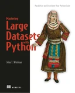
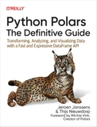
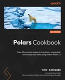
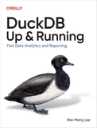
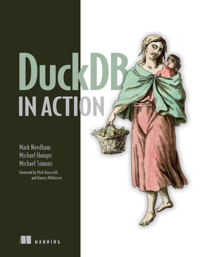

# Books

::: callout-tip
## Accessibility

Books linked here, unless specifically stated, are either open-source and freely available, or available via the GWU Gelman Library through licensing agreements with [O'Reilly Online Learning](https://go.oreilly.com/gwu-edu){target="_blank"} and other services.
:::

## Big Data and the cloud

[{width="80"}](https://learning.oreilly.com/library/view/-/9781617296239/)

## Polars and DuckDB

[{width="76"}](https://learning.oreilly.com/library/view/-/9781098156077/) [{width="81"}](https://learning.oreilly.com/library/view/-/9781805121152/)

[{width="76"}](https://learning.oreilly.com/library/view/-/9781098159689/) [{width="80"}](https://learning.oreilly.com/library/view/duckdb-in-action/9781633437258/)