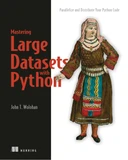
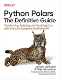
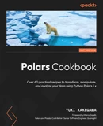
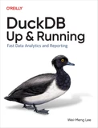
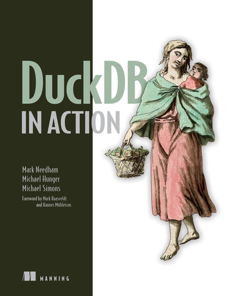

# Books

::: callout-tip
## Accessibility

Books linked here, unless specifically stated, are either open-source and freely available, or available via the GWU Gelman Library through licensing agreements with [O'Reilly Online Learning](https://go.oreilly.com/gwu-edu){target="_blank"} and other services.
:::

## Big Data and the cloud

[{width="80"}](https://learning.oreilly.com/library/view/-/9781617296239/)

## Polars and DuckDB

[{width="76"}](https://learning.oreilly.com/library/view/-/9781098156077/) [{width="81"}](https://learning.oreilly.com/library/view/-/9781805121152/)

[{width="76"}](https://learning.oreilly.com/library/view/-/9781098159689/) [{width="80"}](https://learning.oreilly.com/library/view/duckdb-in-action/9781633437258/)

---

# Readings by Topic

## Python Parallelization (Week 2)

- Wolohan, J. T. *Mastering Large Datasets with Python*. Manning (available on Blackboard). Chapters 1–2.

## Cloud Computing (Week 3)

- Laberis, S. [*What is the Cloud?*](https://learning.oreilly.com/library/view/what-is-the/9781492052913/ch01.html){target="_blank"} O'Reilly, 2019.
- Rittinghouse, J. W. & Ransome, J. F. [*Cloud Computing: Implementation, Management, and Security*](https://ebookcentral.proquest.com/lib/gwu/detail.action?docID=472836){target="_blank"}. CRC Press. Chapter 2. (Available via GWU Gelman Library)

## DuckDB and Polars (Weeks 4–5)

- Lee, W.-M. [*DuckDB Up and Running*](https://learning.oreilly.com/library/view/duckdb-up-and/9781098159689/){target="_blank"}. O'Reilly, 2025. Chapters 2, 4, 8. (Available via O'Reilly Online Learning)
- Janssens, J. & Nieuwdorp, W. [*Python Polars: The Definitive Guide*](https://learning.oreilly.com/library/view/python-polars-the/9781098156077/){target="_blank"}. O'Reilly, 2025. Chapter 5. (Available via O'Reilly Online Learning)

## Ray (Week 6)

- [What is Ray?](https://docs.anyscale.com/get-started/what-is-ray){target="_blank"} — Anyscale documentation
- [Ray Basics](https://docs.anyscale.com/get-started/ray-basics){target="_blank"} — Anyscale documentation
- [Key Concepts of Ray Core](https://docs.ray.io/en/latest/ray-core/key-concepts.html){target="_blank"} — including user guides for Tasks and Actors

## Apache Spark (Weeks 8–11)

- Damji, J. S., Wenig, B., Das, T., & Lee, D. [*Learning Spark*, 2nd Edition](https://pages.databricks.com/rs/094-YMS-629/images/LearningSpark2.0.pdf){target="_blank"}. O'Reilly, 2020. (Free PDF from Databricks)
  - Weeks 8: Chapters 1–3 — Introduction, Getting Started, Structured APIs
  - Week 9: Chapter 7 — Optimizing and Tuning Spark Applications
  - Week 10: Chapter 10 — Machine Learning with MLlib
  - Week 11: Chapter 8 — Structured Streaming
- [PySpark UDF Documentation](https://spark.apache.org/docs/latest/api/python/reference/pyspark.sql/api/pyspark.sql.functions.udf.html){target="_blank"} — Apache Spark
- [Pandas UDF / Arrow-Pandas Integration](https://spark.apache.org/docs/latest/api/python/user_guide/sql/arrow_pandas.html){target="_blank"} — Apache Spark
- [Spark Structured Streaming Programming Guide](https://spark.apache.org/docs/latest/structured-streaming-programming-guide.html){target="_blank"} — Apache Spark

## Spark NLP (Weeks 10–11)

- [Spark NLP Code Concepts](https://nlp.johnsnowlabs.com/docs/en/concepts){target="_blank"} — JohnSnowLabs documentation
- [Spark NLP Annotators Reference](https://nlp.johnsnowlabs.com/docs/en/annotators){target="_blank"} — JohnSnowLabs documentation
- [Spark NLP Models Hub](https://sparknlp.org/models){target="_blank"} — pretrained models catalogue
- Kocaman, V. [Introduction to Spark NLP](https://towardsdatascience.com/introduction-to-spark-nlp-foundations-and-basic-components-part-i-c83b7629ed59){target="_blank"}. *Towards Data Science*.

## Amazon Athena and Apache Airflow (Week 12)

- [Amazon Athena Documentation](https://docs.aws.amazon.com/athena/){target="_blank"} — focus on *Getting Started* and *SQL Reference*
- [AWS Glue Data Catalog Documentation](https://docs.aws.amazon.com/glue/){target="_blank"} — *Crawlers* and *Tables* chapters
- [NYC TLC Yellow Taxi Trip Data Dictionary](https://www.nyc.gov/assets/tlc/downloads/pdf/data_dictionary_trip_records_yellow.pdf){target="_blank"} — NYC Taxi & Limousine Commission
- [Apache Airflow Quickstart](https://airflow.apache.org/docs/apache-airflow/stable/start.html){target="_blank"} — single-node `airflow standalone` setup
- [Amazon MWAA Documentation](https://docs.aws.amazon.com/mwaa/){target="_blank"} — *What is Amazon MWAA?* and *Get started*

## Modern Data Infrastructure (Week 13)

- [Docker — Get Started](https://docs.docker.com/get-started/){target="_blank"}
- [Kubernetes — Concepts Overview](https://kubernetes.io/docs/concepts/overview/){target="_blank"}
- [AWS Lambda — Developer Guide](https://docs.aws.amazon.com/lambda/latest/dg/welcome.html){target="_blank"}
- [Apache Kafka — Introduction](https://kafka.apache.org/intro){target="_blank"}
- [Amazon MSK (Managed Streaming for Apache Kafka)](https://docs.aws.amazon.com/msk/latest/developerguide/what-is-msk.html){target="_blank"}