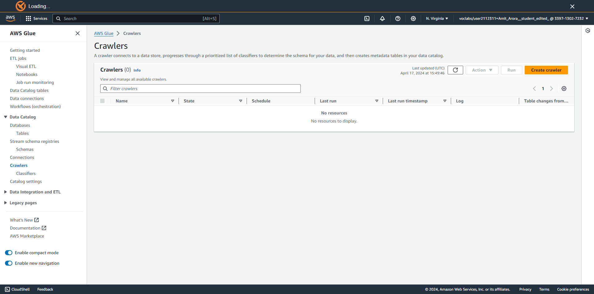
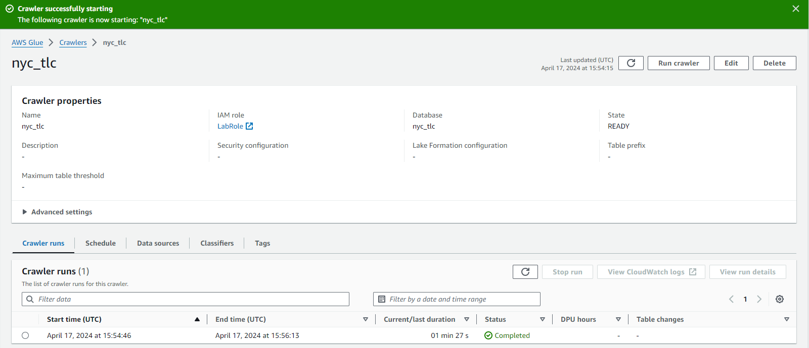
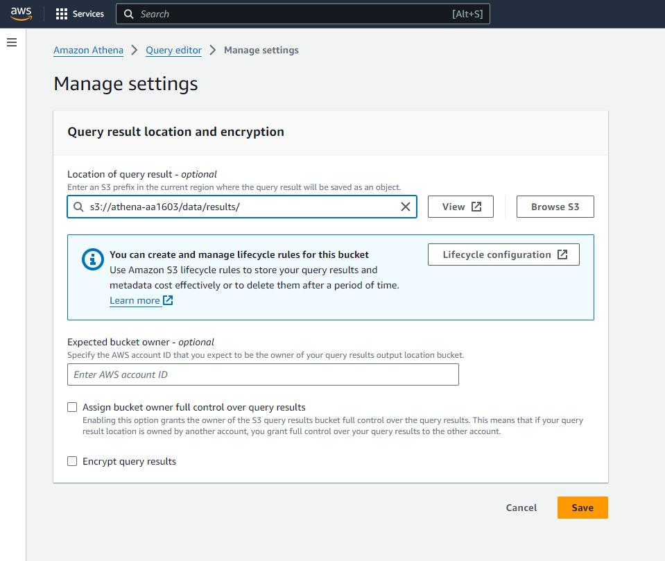
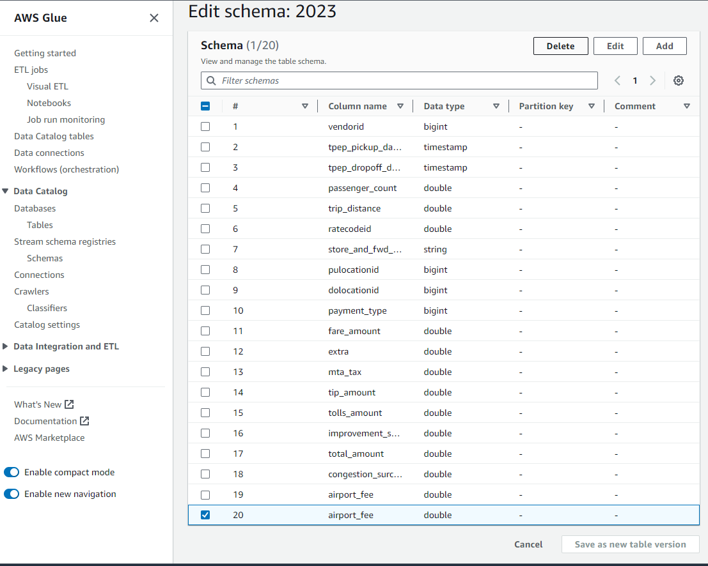
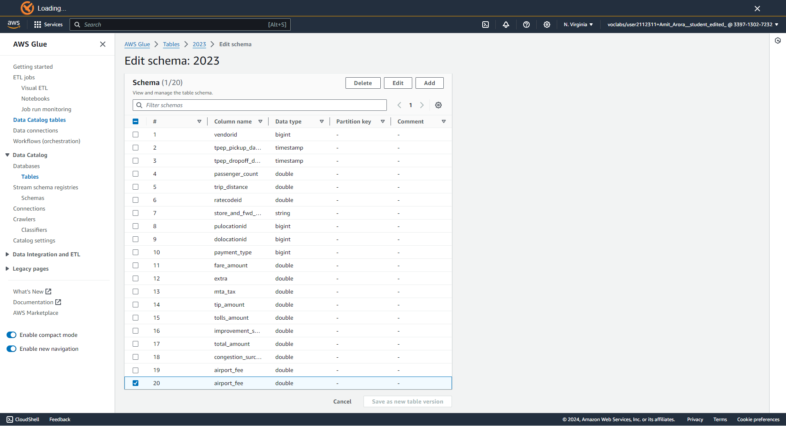

## Where Today's Tools Fit

Tools we've used so far, and where Athena + Airflow slot in:

```
Data sources
    ↓
[S3]  ←──────────────────── data lake (raw Parquet/CSV)
    ↓
[Glue Data Catalog] ←─────── schema registry (databases, tables)
    ↓
[Athena] ─────────────────── serverless SQL, pay-per-scan
    ↓
[Airflow / MWAA] ──────────── orchestration: schedule, backfill, retry
    ↓
Downstream: ML models, dashboards, reports
```

::: {.callout-note}
Spark (Weeks 8–11) is also a valid query/ML engine on S3 — Athena is the **serverless, SQL-only** complement for interactive analytics without cluster management.
:::

## Motivating Example

Imagine you have **6 months of NYC Yellow Taxi trip records** in S3 — about 300 MB of Parquet files.

:::: {.columns}
::: {.column width="55%"}
**The problem:**

* You need 12 ad-hoc aggregations
* You don't want to launch and manage a Spark cluster
* You want to pay only for what you scan
* Results in under 3 minutes, billed in cents

:::

::: {.column width="43%"}
**The answer:**

```sql
SELECT count(*),
       avg(trip_distance),
       sum(total_amount)
FROM "AwsDataCatalog"
     ."nyc_tlc"."2023"
WHERE passenger_count > 0;
```

No cluster. No infra. **Athena.**
:::
::::

# Amazon Athena {.section}

## What is Amazon Athena?

**Amazon Athena** is a serverless, interactive query service that lets you analyze data in **Amazon S3** using standard SQL.

:::: {.columns}
::: {.column width="49%"}
**What you get:**

* Presto/Trino engine under the hood
* Standard ANSI SQL (+ Presto extensions)
* No clusters to provision, patch, or scale
* Concurrent queries across teams
* JDBC/ODBC drivers, console, boto3 API

:::

::: {.column width="49%"}
**Pricing model:**

* **$5 per TB** of data scanned (us-east-1)
* Charged per query; minimum 10 MB
* No charge when query fails before scanning
* Compression + columnar formats reduce cost dramatically
* Free tier: first 1 TB/month in new accounts

:::
::::

## Athena's Core Design Idea

::: {.callout-note}
## Separate compute from storage
Athena's breakthrough is **schema-on-read**: your data lives in S3 in its native format. Athena reads it at query time — no ingestion, no loading, no ETL into a proprietary store.
:::

```
Traditional data warehouse              Athena
─────────────────────────────           ──────────────────────────
1. Extract from source                  1. Drop files in S3
2. Transform into warehouse schema      2. Register schema in Glue Catalog
3. Load into proprietary storage        3. Query immediately with SQL
4. Pay for always-on compute            4. Pay only when querying
5. Manage clusters, scaling, backups    5. Nothing to manage
```

## Athena Architecture

```
┌──────────────────────────────────────────────────────┐
│                    Your SQL query                    │
└─────────────────────┬────────────────────────────────┘
                      │ submit
                      ▼
┌──────────────────────────────────────────────────────┐
│            Athena Query Engine (Presto/Trino)        │
│  ┌─────────────────┐     ┌─────────────────────────┐ │
│  │  Query planner  │────▶│  Distributed executors  │ │
│  └────────┬────────┘     └──────────┬──────────────┘ │
└───────────┼──────────────────────────┼───────────────┘
            │ look up schema           │ read data
            ▼                          ▼
┌─────────────────────┐    ┌───────────────────────────┐
│  AWS Glue Data      │    │    Amazon S3               │
│  Catalog            │    │  s3://bucket/prefix/*.parq │
│  (databases, tables)│    └───────────────────────────┘
└─────────────────────┘
            │ write results
            ▼
┌─────────────────────────────────────────────────────┐
│  Results bucket: s3://bucket/data/results/<id>.csv  │
└─────────────────────────────────────────────────────┘
```

## AWS Glue Data Catalog

The **Glue Data Catalog** is the metadata store shared by Athena, EMR, Redshift Spectrum, and Glue ETL.

:::: {.columns}
::: {.column width="49%"}
**Key concepts:**

* **Database** — logical namespace (like a schema)
* **Table** — maps a name to an S3 location + format + column definitions
* **Partitions** — sub-paths within the table location
* **Table version** — schema edit history

:::

::: {.column width="49%"}
**Key properties stored per table:**

```
Location:   s3://bucket/prefix/
InputFormat: Parquet / ORC / CSV / JSON
Columns:    name, type pairs
Partitions: year=2023/month=01/…
SerDe:      org.apache.hadoop.hive.ql
            .io.parquet.serde.ParquetHiveSerDe
```

:::
::::

::: {.callout-tip}
The Glue Catalog is free up to 1 million objects; additional objects billed per million per month.
:::

## Two Ways to Register a Table

:::: {.columns}
::: {.column width="49%"}
### Glue Crawler (Lab 05)

```
Glue → Crawlers → Create
  ↓  Configure S3 source
  ↓  Assign IAM role
  ↓  Choose output DB
  ↓  Run crawler
  ↓  Table auto-created
```

**Pros:** zero schema knowledge needed
**Cons:** inference can go wrong (duplicate columns, wrong types)

Best for: **discovery** of new/unknown data

:::

::: {.column width="49%"}
### Explicit DDL (Lab 10)

```sql
CREATE EXTERNAL TABLE IF NOT EXISTS
  shelter_counts (
    year INT, month INT, day INT,
    adults INT, children INT,
    total INT
  )
STORED AS PARQUET
LOCATION 's3://bucket/shelter_data/';
```

**Pros:** exact schema control, CI-friendly
**Cons:** must know the schema upfront

Best for: **production pipelines** with stable schemas

:::
::::

## Columnar Formats — Why Athena Loves Parquet

Athena charges per **byte scanned**. Columnar storage makes this much cheaper.

:::: {.columns}
::: {.column width="49%"}
**Row-oriented (CSV):**
```
trip_id, distance, fare, tip, passenger
1001,    2.3,     12.5, 2.0, 1
1002,    8.7,     28.0, 4.5, 2
...  (all columns, every row)
```
`SELECT avg(fare)` → scans **every column**

:::

::: {.column width="49%"}
**Column-oriented (Parquet):**
```
[trip_id column: 1001, 1002, ...]
[distance column: 2.3, 8.7, ...]
[fare column: 12.5, 28.0, ...]   ← only this
[tip column: 2.0, 4.5, ...]
```
`SELECT avg(fare)` → scans **only fare column**

:::
::::

::: {.callout-note}
Real-world impact: a query on a 1 TB CSV table that touches 3 of 30 columns might scan ~100 GB as Parquet — saving ~$4.50 per query execution.
:::

## Athena Cost Model

| Scenario | Data scanned | Cost (est.) |
|---|---|---|
| 6-month NYC taxi (Parquet) | 300 MB | < $0.01 |
| Same data in CSV | ~2.5 GB | ~$0.01 |
| 1 year of taxi (Parquet, unpartitioned) | 600 MB | ~$0.003 |
| 1 year of taxi (Parquet, partitioned by month) | 50 MB per month-query | ~$0.0003 |
| Large analytics table, 10 TB CSV | 10 TB | $50.00 |
| Same, converted to ORC with partitions | ~500 GB | $2.50 |

::: {.callout-tip}
The two most impactful cost-reduction moves: (1) **convert to Parquet/ORC**, (2) **partition your data**.
:::

## Setup: Create Your S3 Bucket

```bash
NETID=your-netid
BUCKET=athena-$NETID

aws s3 mb s3://$BUCKET --region us-east-1
```

The bucket serves as your entire data lake for this lab:

```
s3://athena-<netid>/
  data/
    2023/               ← raw Parquet taxi files
    results/            ← Athena query results (required!)
  shelter_data/         ← Lab 10: shelter counts Parquet
  weather_data/         ← Lab 10: weather-augmented Parquet
  athena-counts-temp/   ← Lab 10: Athena result spill
```

## Setup: Stage Taxi Data

Download 6 months of NYC TLC Yellow Taxi trip records directly into S3:

```bash
for month in {01..06}; do
  wget -qO- \
    "https://d37ci6vzurychx.cloudfront.net/trip-data/yellow_tripdata_2023-${month}.parquet" \
    --no-check-certificate \
  | aws s3 cp - "s3://$BUCKET/data/2023/yellow_tripdata_2023-${month}.parquet"
done
```

::: {.callout-note}
The `wget ... | aws s3 cp -` pipeline streams from the CDN directly into S3 — no local disk needed. Each file is ~47–58 MB of compressed Parquet.
:::

## Verify the S3 Layout

```bash
aws s3 ls s3://$BUCKET/data/2023/
```

Expected output:
```
2025-01-15 12:03:22   47,673,424 yellow_tripdata_2023-01.parquet
2025-01-15 12:03:31   51,241,008 yellow_tripdata_2023-02.parquet
2025-01-15 12:03:40   58,492,817 yellow_tripdata_2023-03.parquet
2025-01-15 12:03:49   57,891,230 yellow_tripdata_2023-04.parquet
2025-01-15 12:03:57   54,308,645 yellow_tripdata_2023-05.parquet
2025-01-15 12:04:06   51,027,193 yellow_tripdata_2023-06.parquet
```

6 files, ~320 MB total. A full year's worth is a $0.003 Athena query.

## Glue Crawler: Create and Configure

::: {.imgcenter}

:::

Navigate: **AWS Console → Glue → Data Catalog → Crawlers → Create crawler**

Configure: name `nyc_tlc`, S3 source `s3://athena-<netid>/data/2023/`, IAM role `LabRole`, output database `nyc_tlc`

## Glue Crawler: Run Result

::: {.imgcenter}

:::

After a successful run, Glue creates table **`2023`** in database **`nyc_tlc`** — the folder name becomes the table name.

## First Athena Query: Results Location

::: {.callout-warning}
## Required before any query will run
Athena stores every query result as a CSV in S3. You must set this location before running your first query — Athena will refuse otherwise.

**Console: Settings → Manage → Query result location:**
`s3://athena-<netid>/data/results/`
:::

::: {.imgcenter}

:::

## Fully-Qualified Naming

Athena uses a three-part name: `catalog.database.table`

```sql
-- Fully qualified (unambiguous across all catalogs)
SELECT count(*)
FROM "AwsDataCatalog"."nyc_tlc"."2023";

-- Short form (works when database is set in session)
SELECT count(*) FROM "2023";
```

::: {.callout-note}
`"AwsDataCatalog"` is the default catalog — the Glue Data Catalog for your account. Athena also supports federated queries to other catalogs (RDS, DynamoDB, etc.) via Lambda connectors.
:::

The result: **~19.5 million** rows across 6 months of Yellow Taxi trips.

## Gotcha: Duplicate Column from Crawler

The crawler can mis-infer schema — notably, the `airport_fee` column appears **twice** in the NYC taxi data.

::: {.imgcenter}

:::

**Fix:** Glue Data Catalog → Tables → `2023` → Edit schema → delete the duplicate `airport_fee` row → **Save as new table version**

::: {.imgcenter}

:::

## Analytical SQL: `approx_percentile`

Presto/Trino includes **approximate aggregation functions** that are much faster than exact percentile computation on large datasets.

```sql
SELECT
  approx_percentile(trip_distance, 0.25) AS q1,
  approx_percentile(trip_distance, 0.50) AS median,
  approx_percentile(trip_distance, 0.75) AS q3
FROM "AwsDataCatalog"."nyc_tlc"."2023"
WHERE trip_distance > 0 AND trip_distance < 100;
```

::: {.callout-note}
`approx_percentile` uses a **TDigest sketch** — it processes data in a single pass and uses O(1/ε) memory, making it practical for 20M+ row tables where exact percentiles would require a full sort.
:::

## IQR Anomaly Detection — Part 1

Compute interquartile range in a scalar sub-query, then cross-join to the full table:

```sql
SELECT
    approx_percentile(trip_distance, 0.25) AS q1,
    approx_percentile(trip_distance, 0.50) AS q2,
    approx_percentile(trip_distance, 0.75) AS q3
FROM "AwsDataCatalog"."nyc_tlc"."2023"
WHERE trip_distance > 0 AND trip_distance < 100
```

This scalar query returns **one row** with Q1, Q2, Q3 — the basis for the IQR fence.

`IQR = Q3 − Q1`
`Lower fence = Q1 − 1.5 × IQR`
`Upper fence = Q3 + 1.5 × IQR`

## IQR Anomaly Detection — Part 2 {.smaller}

```sql
SELECT * FROM (
  SELECT
    t.pulocationid, t.dolocationid,
    t.tpep_pickup_datetime, t.tpep_dropoff_datetime,
    t.trip_distance,
    q1, q2, q3,
    (q3 - q1) AS iqr,
    CASE
      WHEN t.trip_distance < (q1 - 1.5 * (q3 - q1))
        OR t.trip_distance > (q3 + 1.5 * (q3 - q1))
      THEN 'Anomaly'
      ELSE 'Normal'
    END AS trip_distance_anomaly
  FROM
    (SELECT
        approx_percentile(trip_distance, 0.25) AS q1,
        approx_percentile(trip_distance, 0.50) AS q2,
        approx_percentile(trip_distance, 0.75) AS q3
     FROM "AwsDataCatalog"."nyc_tlc"."2023"
     WHERE trip_distance > 0 AND trip_distance < 100
    ) AS quartiles,
    "AwsDataCatalog"."nyc_tlc"."2023" AS t
  WHERE t.trip_distance > 0
) AS anomaly_detection
WHERE trip_distance_anomaly = 'Anomaly'
LIMIT 1000;
```

A cross-join of a one-row scalar sub-query against the full table is efficient — Presto broadcasts the scalar side.

## Performance: Partitioning

**Partitioning** splits data into S3 sub-paths that Athena can prune at query time.

:::: {.columns}
::: {.column width="49%"}
**Hive-style partition layout:**
```
s3://bucket/trips/
  year=2023/
    month=01/
      part-00000.parquet
    month=02/
      part-00000.parquet
```

**DDL with partitions:**
```sql
CREATE EXTERNAL TABLE trips (...)
PARTITIONED BY (year INT, month INT)
STORED AS PARQUET
LOCATION 's3://bucket/trips/';
MSCK REPAIR TABLE trips;
```
:::

::: {.column width="49%"}
**Impact:**

| Query | Scanned |
|---|---|
| All data (no partition) | 100% |
| `WHERE month=03` (partitioned) | ~8% |
| `WHERE year=2023 AND month=03` | ~1.4% |

Use **partition projection** to avoid `MSCK REPAIR TABLE` on new partitions — declare the range in table properties.
:::
::::

## Performance: File Size and Compression

**Target: 128 MB – 512 MB per Parquet/ORC file**

:::: {.columns}
::: {.column width="55%"}
Too many small files → high S3 LIST overhead and request fan-out
Too few huge files → poor parallelism and slow query startup

**Compression codecs:**

| Codec | Speed | Ratio | Splittable |
|---|---|---|---|
| SNAPPY | Fast | Moderate | No |
| ZSTD | Fast | High | No |
| GZIP | Slow | High | No |
| LZ4 | Fastest | Low | No |

For Athena: **ZSTD** is the sweet spot — better compression than Snappy, nearly as fast.
:::

::: {.column width="43%"}
::: {.callout-tip}
Parquet files are block-level splittable even without a splittable codec because the row group metadata allows Athena to skip groups.

For files < 64 MB: compact with CTAS before production use.
:::
:::
::::

## Explicit DDL: `CREATE EXTERNAL TABLE`

From Lab 10 — creating the shelter counts table without a crawler:

```sql
CREATE EXTERNAL TABLE IF NOT EXISTS shelter_counts (
    year     INT,
    month    INT,
    day      INT,
    adults   INT,
    children INT,
    total    INT
)
STORED AS PARQUET
LOCATION 's3://athena-<netid>/shelter_data/';
```

Run this via the Athena console or with the CLI:

```bash
aws athena start-query-execution \
  --query-string "CREATE EXTERNAL TABLE ..." \
  --query-execution-context Database=shelter_db \
  --result-configuration OutputLocation=s3://athena-<netid>/athena-counts-temp/
```

## DDL vs Crawler — When to Use Which

| | Crawler | Explicit DDL |
|---|---|---|
| Schema knowledge | Not needed | Required |
| Schema accuracy | Best-effort inference | Exact |
| Updates | Re-run crawler | `ALTER TABLE` or recreate |
| CI/CD friendly | Harder | Yes (SQL files in git) |
| New data sources | | |
| (unknown format) | ✅ | ❌ |
| Production pipelines | ❌ | ✅ |
| Airflow-managed ETL | ❌ | ✅ |

::: {.callout-tip}
**Use the crawler** to discover and prototype. **Switch to DDL** once the schema is stable and pipelines are automated.
:::

## Writing Back: CTAS and INSERT INTO

Athena can write results back to S3 — useful for materializing expensive queries.

```sql
-- CTAS: create a new table from a SELECT result
CREATE TABLE taxi_anomalies
WITH (
  format = 'PARQUET',
  write_compression = 'SNAPPY',
  external_location = 's3://athena-<netid>/data/anomalies/'
)
AS SELECT * FROM anomaly_detection_view
WHERE trip_distance_anomaly = 'Anomaly';
```

```sql
-- INSERT INTO: append rows to an existing external table
INSERT INTO shelter_counts
VALUES (2025, 10, 30, 47891, 12340, 60231);
```

::: {.callout-warning}
`INSERT INTO` is limited — Athena does not support `UPDATE` or `DELETE` (it's not a transactional store). For upsert patterns, use CTAS with a filter or Apache Iceberg tables.
:::

## Programmatic Athena — boto3 Setup

```python
import boto3, time, os
import pandas as pd

S3_BUCKET_NAME  = "athena-your-netid"
SCHEMA_NAME     = "nyc_tlc"
S3_STAGING_PREFIX = "data/results"
S3_STAGING_DIR  = f"s3://{S3_BUCKET_NAME}/{S3_STAGING_PREFIX}/"
AWS_REGION      = "us-east-1"

athena_client = boto3.client("athena", region_name=AWS_REGION)
s3_client     = boto3.client("s3",     region_name=AWS_REGION)
```

::: {.callout-note}
On EC2 with the `LabRole` instance profile attached, boto3 picks up credentials automatically — no `aws configure` needed.
:::

## Programmatic Athena — `start_query_execution`

```python
query = """
    SELECT pulocationid,
           count(*) AS trip_count
    FROM "AwsDataCatalog"."nyc_tlc"."2023"
    GROUP BY pulocationid
    ORDER BY trip_count DESC
    LIMIT 5
"""

response = athena_client.start_query_execution(
    QueryString=query,
    QueryExecutionContext={"Database": SCHEMA_NAME},
    ResultConfiguration={
        "OutputLocation": S3_STAGING_DIR,
        "EncryptionConfiguration": {"EncryptionOption": "SSE_S3"},
    },
)
query_id = response["QueryExecutionId"]
```

`start_query_execution` returns **immediately** — Athena executes asynchronously.

## Programmatic Athena — Poll and Download {.smaller}

```python
# Poll until the query finishes
while True:
    try:
        athena_client.get_query_results(QueryExecutionId=query_id)
        break
    except Exception as err:
        if "not yet finished" in str(err):
            time.sleep(0.5)
        else:
            raise err

# Athena writes the result CSV to S3
result_key = f"{S3_STAGING_PREFIX}/{query_id}.csv"
s3_client.download_file(S3_BUCKET_NAME, result_key, "result.csv")

df = pd.read_csv("result.csv")
print(df)
```

## Async Query Lifecycle

```
start_query_execution()
        │
        ▼
   [QUEUED] ─── waiting for an executor slot
        │
        ▼
  [RUNNING] ─── scanning S3, computing aggregations
        │
        ▼
[SUCCEEDED] ─── result CSV written to s3://…/results/<id>.csv
        │
        ▼
 download from S3 → pd.read_csv()
```

::: {.callout-tip}
For production use, prefer `get_query_execution` with exponential backoff over the tight polling loop shown here. AWS also provides the **Athena JDBC driver** for BI tools that need a blocking interface.
:::

## Security: IAM and Lake Formation

:::: {.columns}
::: {.column width="49%"}
**IAM-based (what we use in class):**

* `LabRole` is pre-granted:
  * `s3:GetObject` on lab buckets
  * `glue:GetTable`, `glue:GetDatabase`
  * `athena:StartQueryExecution`
  * `athena:GetQueryResults`
* Simple; all-or-nothing per bucket

:::

::: {.column width="49%"}
**Lake Formation (production):**

* Column-level security: hide PII columns per IAM principal
* Row-level filters: `WHERE department = 'finance'` enforced at the catalog
* Tag-based access control across Athena, EMR, Redshift
* Audit trail via CloudTrail

:::
::::

## Athena Limits and Gotchas

| Limit / Gotcha | Detail |
|---|---|
| Query timeout | 30 minutes max per query |
| Result location | **Must be set** before first query — Athena refuses to run without it |
| `ON CONFLICT` | Not supported — Athena/Presto is not a transactional engine |
| `UPDATE` / `DELETE` | Not supported for external tables (use Iceberg for ACID) |
| Hive-style identifiers | Column names must be lowercase; mixed-case requires quoting |
| Schema-on-read | No validation at write time — bad files silently return NULLs |
| Duplicate crawler columns | `airport_fee` gotcha — always verify schema after crawling |

## Athena Wrap

:::: {.columns}
::: {.column width="55%"}
**Key takeaways:**

* S3 + Glue Catalog + SQL = **serverless analytics**
* Pay per scan; use Parquet + partitions to keep bills tiny
* Two registration paths: Crawler (discovery) vs. DDL (production)
* Presto SQL unlocks approximate analytics at scale
* boto3 gives full programmatic control

:::

::: {.column width="43%"}
::: {.callout-note}
## The next question
You've queried static Parquet in S3. But what if **new data arrives every day** and you want to:

* Extract it automatically
* Transform and load it into the Athena table
* Retry on failure
* Backfill months of history

→ **Apache Airflow**
:::
:::
::::
