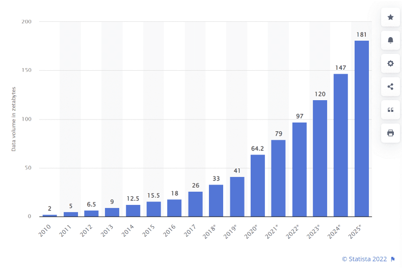

# Distributed File Systems and HDFS

## Why do we need distributed storage?

:::: {.columns}
::: {.column width="50%"}
### The scale problem

Modern applications generate data at rates that far exceed what any single machine can store or process:

- Social media: billions of posts, images, videos
- IoT sensors: trillions of readings per day
- Web crawls: petabytes of HTML, images, links
- Scientific simulations: terabytes per run

:::
::: {.column width="50%"}
{fig-align="center"}
:::
::::

## Yesterday's solution: scale up

:::: {.columns}
::: {.column width="50%"}
### The 1990s approach
**One big box — all processors share memory**

- Very expensive, low-volume hardware
- All-premium components
- Storage and compute tightly coupled

**But even the biggest single machine wasn't big enough!**
:::
::: {.column width="50%"}
{width=350}
:::
::::

## Today's solution: scale out with commodity hardware

:::: {.columns}
::: {.column width="50%"}
### Consumer-grade servers

Not expensive, premium, or fancy in any way

**Buy lots of cheap, desktop-like servers!**

- Easy to add capacity
- Cheaper per CPU/disk
- Failure is the norm, not the exception

### The catch

Need more complex *software* to coordinate many cheaper machines.
:::
::: {.column width="50%"}
{width=350}
:::
::::

## Problems with commodity hardware

:::: {.columns}
::: {.column width="50%"}
### Failure rates
- 1–5% of hard drives fail per year
- ~0.2% of DIMMs fail per year
- On a 1,000-node cluster, expect failures *every week*

### Network vs. shared memory
- Much more latency than RAM
- Network throughput << local disk throughput

### Uneven performance
- "Stragglers" slow the entire job
:::
::: {.column width="50%"}

:::
::::

# {.section}

**Big data processing systems are built on average machines that fail pretty often.**

*The software must treat failure as a routine event, not an exception.*

## What is a distributed file system?

A **distributed file system (DFS)** stores data across many machines while presenting a single, unified namespace to clients.

:::: {.columns}
::: {.column width="50%"}
### Key properties
- **Single namespace**: `/user/data/logs/` looks the same from every node
- **Fault tolerance**: data survives individual node failures
- **Scalability**: add capacity by adding machines
- **Data locality**: move computation to the data, not data to computation
:::
::: {.column width="50%"}
{fig-align="center"}
:::
::::


## The Google File System (2003): the blueprint

:::: {.columns}
::: {.column width="50%"}

:::
::: {.column width="50%"}
### Why GFS matters

Google's 2003 paper described a production file system built from commodity hardware, designed around the assumption that:

- Component failures are the *norm*
- Files are huge (multi-GB) and write-once/read-many
- Sequential reads dominate random reads
- Relaxed consistency is acceptable for batch workloads

GFS proved that a reliable, large-scale distributed file system could be built cheaply.
:::
::::

::: aside
Ghemawat, S., Gobioff, H., & Leung, S. T. (2003). The Google file system. *SOSP '03*.
:::


## HDFS: the open-source GFS

:::: {.columns}
::: {.column width="50%"}
### Origin story

- 2004: Doug Cutting and Mike Cafarella implement GFS ideas in Java as part of Nutch → *Nutch Distributed File System (NDFS)*
- 2006: NDFS becomes **HDFS** when Hadoop is spun out of Nutch/Lucene
- Yahoo! adopts Hadoop; Doug Cutting joins Yahoo!
- 2008: World record — 1 TB sorted in 209 seconds on a 910-node cluster

{width=250}
:::
::: {.column width="50%"}
### Why Hadoop won

Google File System is a proprietary product. Nobody outside Google could use it.

Hadoop is **open source** (Apache License). Anyone can use, modify, and deploy it.

> "Who has heard of Colossus?" *(Google's successor to GFS — almost nobody outside Google)*

Open source → ecosystem → community → adoption.
:::
::::

## HDFS architecture: NameNode and DataNodes

:::: {.columns}
::: {.column width="50%"}
### NameNode (master)
- Manages the **file system namespace**: directory tree, file-to-block mappings, permissions
- Stores metadata in memory (`fsimage` + edit log)
- Does **not** store actual file data

### DataNodes (workers)
- Store and serve actual **data blocks**
- Report block inventory to NameNode via heartbeats
- Replicate blocks between each other on instruction
:::
::: {.column width="50%"}
{fig-align="center"}
:::
::::

::: aside
White, T. (2015). *Hadoop: The Definitive Guide*, 4th ed. O'Reilly.
:::


## HDFS design principles

:::: {.columns}
::: {.column width="50%"}
### Block-based storage
- Files are split into fixed-size **blocks** (default: 128 MB in HDFS 3.x)
- Each block is stored independently on a DataNode
- Allows large files to span many disks and machines

### Replication
- Each block is replicated **3×** by default (configurable)
- Replicas are placed across different nodes and racks
- If a DataNode fails, the NameNode re-replicates its blocks elsewhere

:::
::: {.column width="50%"}
### Rack-aware placement
{fig-align="center" height="400"}
:::
::::

::: aside
White, T. (2015). *Hadoop: The Definitive Guide*, 4th ed. O'Reilly.
:::


## Data locality: move computation to the data

:::: {.columns}
::: {.column width="50%"}
### The key insight

Network is the bottleneck, not CPU.

**Old model:** copy data to where the code runs.
**HDFS/MapReduce model:** run code where the data already lives.

When possible, the scheduler assigns work to a node that *already holds* the relevant block. This eliminates most network traffic for data-intensive workloads.
:::
::: {.column width="50%"}
### Consequence: HDFS is tightly coupled to Hadoop/YARN

- YARN resource manager knows which DataNode holds which blocks
- Assigns Map tasks to nodes with local copies first
- Falls back to same-rack nodes, then cross-rack

:::
::::


## HDFS is designed for specific workloads

| Pattern | HDFS handles well | HDFS handles poorly |
|---|---|---|
| **File size** | Large files (GB–TB) | Millions of small files |
| **Access pattern** | Sequential reads | Random reads/writes |
| **Write pattern** | Write-once, append-only | Frequent overwrites |
| **Latency** | High throughput | Low-latency access |
| **Clients** | Batch jobs | Interactive queries |

::: {.callout-note}
HDFS is optimized for the analytics batch processing use case — reading entire datasets sequentially — not for serving web requests or online transactions.
:::


## HDFS scalability

:::: {.columns}
::: {.column width="50%"}

:::
::: {.column width="50%"}
### Scaling is linear

- Add a DataNode → cluster gains storage and bandwidth
- NameNode can manage **hundreds of millions of blocks**
- Real-world clusters:
  - Yahoo! (2010): 4,000 nodes, ~70 PB
  - Facebook (2010): 2,300 nodes, ~40 PB
  - Twitter (2017): 500+ PB across clusters


:::
::::


## HDFS vs. Cloud Object Storage

As cloud computing matured, object stores (S3, Azure Blob, GCS) became a popular alternative to HDFS for large-scale storage.

| | HDFS | Cloud Object Store |
|---|---|---|
| **Scalability** | Bound by NameNode | Virtually unlimited |
| **Coupling** | Storage + compute together | Storage separate from compute |
| **Cost** | CapEx (servers) | OpEx (pay per GB) |
| **Fault tolerance** | 3× replication | Built in (provider-managed) |
| **Interface** | POSIX-like CLI / Java API | REST API (`s3://`, `abfs://`) |
| **Data locality** | Yes | No (network always) |


## De-coupling storage from compute

:::: {.columns}
::: {.column width="55%"}
### The modern cloud data lake pattern

Storage and compute are **separate, independently scalable** systems.

- **Before**: HDFS nodes store data *and* run MapReduce tasks
- **After**: Data lives in S3/GCS/ADLS; compute clusters (Spark, EMR, Databricks) spin up, read from object store, and spin down

**Benefits:**
- Pay only for compute while jobs run
- Store data indefinitely at low cost
- Mix and match compute engines
:::
::: {.column width="45%"}
{fig-align="center"}

::: aside
Gopalan, R. (2022). *The Cloud Data Lake*. O'Reilly.
:::
:::
::::


## HDFS command-line interface

HDFS exposes a shell interface that mirrors Unix filesystem commands:

```{.bash code-line-numbers="false"}
# List files
hdfs dfs -ls /user/hadoop/data/

# Copy local file to HDFS
hdfs dfs -put localfile.csv /user/hadoop/data/

# Copy from HDFS to local
hdfs dfs -get /user/hadoop/data/output/ ./output/

# Print contents of a file
hdfs dfs -cat /user/hadoop/data/results/part-00000

# Create a directory
hdfs dfs -mkdir /user/hadoop/staging

# Remove a file or directory
hdfs dfs -rm -r /user/hadoop/staging
```

Full reference: [HDFS Shell Commands](https://hadoop.apache.org/docs/stable/hadoop-project-dist/hadoop-common/FileSystemShell.html)


## The Hadoop ecosystem

{.r-stretch}

HDFS is the storage foundation; dozens of tools have been built on top of it.
Live reference: <https://hadoopecosystemtable.github.io/>


## Summary: why distributed file systems matter

:::: {.columns}
::: {.column width="50%"}
### The core ideas

1. **Commodity hardware fails** — design for resilience, not around it
2. **Block-based replication** provides fault tolerance without expensive RAID
3. **Data locality** eliminates network as the bottleneck
4. **Single namespace** hides distributed complexity from applications
5. **Write-once / append** simplifies consistency
:::
::: {.column width="50%"}
### HDFS's legacy

HDFS proved these ideas work at internet scale. Even as cloud object stores have largely supplanted HDFS for new deployments, every modern data lake — S3, Azure Data Lake, GCS — inherits the same core principles:

- Replication and fault tolerance
- Massive scalability through horizontal partitioning
- Decoupling of storage and compute
:::
::::
