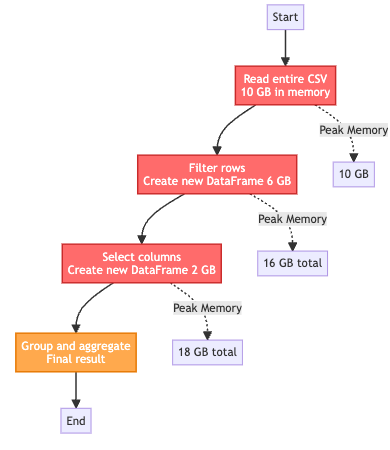

# Polars + DuckDB + Parquet

## The Modern Local Analytics Stack

Fast, flexible analytics on your laptop—no cluster required

::: notes
Introduce the trio and the core idea: warehouse-level analytics locally by combining columnar storage (Parquet), pushdown (predicate/projection), and vectorized engines (DuckDB, Polars). Emphasize in-process execution and Arrow-based interoperability.
:::

## The Challenge

::: highlight-box
**Modern data science faces critical bottlenecks:**
:::

-   **Volume**: Datasets exceeding available RAM are increasingly common
-   **Distribution**: Data stored across cloud object storage (S3, Azure Blob, GCS)
-   **Performance**: Traditional tools (Pandas, SQLite) struggle with scale
-   **Cost**: Inefficient data processing translates to higher cloud costs

*We need tools designed for modern data infrastructure from the ground up.*

## DuckDB

In‑process SQL OLAP engine with vectorized execution. Reads/writes Parquet and excels at joins, aggregations, and window functions—fast analytics without a server.

::: notes
Highlight that DuckDB is an embedded engine (no server), optimized for OLAP workloads. Discuss out-of-core capability, parallelism, and how it pushes filters and projections into Parquet scans to minimize I/O.
:::

# Side road: OLAP & OLTP

## What is OLAP?

**Online Analytical Processing**

Systems designed for complex analytical queries

-   Handles business intelligence and reporting
-   Complex queries across large datasets
-   Primarily read-intensive with periodic bulk loads
-   Column-oriented storage optimized for analytics
-   Sub-second to minutes response time

## What is OLTP?

**Online Transaction Processing**

Systems designed for real-time operational transactions

-   Handles daily business operations (sales, orders, payments)
-   Fast, short transactions with immediate results
-   Frequent inserts, updates, and deletes
-   Row-oriented storage optimized for writes
-   Millisecond response times with ACID guarantees

## Head-to-Head Comparison

| Aspect        | OLTP                   | OLAP                      |
|---------------|------------------------|---------------------------|
| **Purpose**   | Transaction processing | Data analysis             |
| **Data Type** | Current operational    | Historical aggregated     |
| **Queries**   | Simple, few rows       | Complex, millions of rows |
| **Workload**  | Heavy writes           | Heavy reads               |
| **Storage**   | Row-based              | Column-based              |
| **Users**     | Thousands+ concurrent  | Dozens of analysts        |
| **Response**  | Milliseconds           | Seconds to minutes        |

## OLAP Use Cases

**Analytical Workloads**

-   **Business Intelligence**: Sales trend analysis and revenue forecasting
-   **Data Warehousing**: Multi-dimensional reporting across departments
-   **Financial Analysis**: Quarterly performance aggregations and comparisons
-   **Marketing Analytics**: Campaign effectiveness across customer segments
-   **Supply Chain**: Historical demand patterns and inventory optimization

## OLTP Use Cases

**Operational Workloads**

-   **E-commerce**: Processing customer orders and payments in real-time
-   **Banking**: ATM transactions, account updates, wire transfers
-   **Inventory Management**: Real-time stock level tracking and updates
-   **CRM Systems**: Customer data entry, modifications, and lookups
-   **Booking Systems**: Hotel/flight reservations with immediate confirmation

# Back to normal programming

## Polars

Rust‑based DataFrame with lazy and eager APIs, query optimization, and parallel execution. Arrow‑native for fast wrangling, grouping, joins, and analytics pipelines.

::: notes
Explain Polars’ lazy query plans, projection/predicate pushdown, and concise expression syntax. Mention parallel execution and strong integration with Arrow for efficient compute and data interchange.
:::

## How They Interplay

Parquet dataset → \[Scan + Pushdown\] → DuckDB (SQL) ↔ Arrow ↔ Polars (Expressions) → Parquet (results)

-   Columnar synergy: skip unused columns
-   Row‑group pruning via statistics
-   Zero/low‑copy Arrow interchange
-   In‑process OLAP on a single machine

::: notes
Walk through the flow: engines scan Parquet with predicate/projection pushdown, reduce I/O, execute vectorized operators, and interchange via Arrow with minimal copying. Emphasize that both tools operate efficiently on columnar data and run locally.
:::

## Why It’s Useful

-   Near‑warehouse performance
-   Efficient, larger‑than‑RAM reads
-   Interoperable across the data stack
-   Switch between SQL and expressions
-   Simple, low‑cost, no servers
-   Reproducible Parquet snapshots

::: notes
Map each benefit to common pain points: speed without clusters, memory efficiency via selective reads, portability using a ubiquitous format, team flexibility (SQL vs expressions), lower operational overhead, and reproducibility with immutable Parquet snapshots.
:::

## Typical Workflows

1.  Explore: Query partitioned Parquet with DuckDB SQL for fast summaries.
2.  Transform: Build Polars lazy pipelines; push filters/projections into scans.
3.  Combine: Use DuckDB for heavy joins; hand off via Arrow to Polars.
4.  Persist: Save curated results/features back to Parquet for training or sharing.

::: notes
Stress that data lives in Parquet throughout. You can pivot between SQL (DuckDB) and expressions (Polars) without costly data moves. Encourage partitioning by selective keys to enable pruning.
:::

## Practical Tips

-   Partitioning: Use selective keys (e.g., dt=YYYY‑MM‑DD, region) and keep stats.
-   Column selection: Project only needed columns for faster scans.
-   File sizing: Target 100–512 MB files; row groups \~64–256 MB.
-   Schema evolution: Track types; avoid expensive casts and mixed dtypes.
-   I/O locality: Cache or work on local copies for iterative dev.
-   Interchange: Use Arrow for minimal copies between DuckDB and Polars.

::: notes
Explain the “small files problem” and benefits of appropriately sized files/row groups. Ensure Parquet statistics are written. Mention that local caching can accelerate iterative work against cloud stores.
:::

# Polars

Lightning-fast DataFrame library for Rust and Python

## Before we begin..

> [Pandas](https://pandas.pydata.org/) is a fast, powerful, flexible and easy to use open source data analysis and manipulation tool, built on top of the Python programming language.

::: incremental
1.  Pandas is slow, well yes but also, not so much if you use it the right way.

-   [Apache Arrow and the "10 Things I Hate About pandas"](https://wesmckinney.com/blog/apache-arrow-pandas-internals/) (<font color=red size=5>A 2017 post from the creator of Pandas..</font>)

-   [50 times faster data loading for Pandas: no problem](https://blog.esciencecenter.nl/irregular-data-in-pandas-using-c-88ce311cb9ef) (<font color=red size=5>but this is an old 2019 article..</font>)

-   [Is Pandas really that slow?](https://medium.com/@tommerrissin/is-pandas-really-that-slow-cff4352e4f58)

1.  [Pandas 2.0 and the arrow revolution](https://datapythonista.me/blog/pandas-20-and-the-arrow-revolution-part-i)
:::

## Polars

](polars/img/polars.jpg)

## Why is Polars faster than Pandas? {.smaller}

::: incremental
1.  **Polars is written in Rust**. Rust is a compiled language, Python is an interpreted language.

    -   Compiled language: you generate the machine code only once then run it, subsequent runs do not need the compilation step.
    -   Interpreted language: code has to be parsed, interpreted and converted into machine code every single time.

2.  **Parallelization**: Vectorized operations that can be executed in parallel on multiple CPU cores.

3.  **Lazy evaluation**: Polars supports two APIs lazy as well as eager evaluation (used by pandas). In lazy evaluation, a query is executed only when required. While in eager evaluation, a query is executed immediately.

4.  **Polars uses [Arrow](https://arrow.apache.org/)** as its in-memory representation of data. Similar to how pandas uses Numpy (although Pandas 2.0 does allow using Arrow as the backend in addition to Numpy).

    -   \[Excerpt from [this post](https://news.ycombinator.com/item?id=26454585) from [Ritchie Vink](https://github.com/ritchie46), author of Polars\] Arrow provides the efficient data structures and some compute kernels, like a SUM, a FILTER, a MAX etc. Arrow is not a query engine. Polars is a DataFrame library on top of arrow that has implemented efficient algorithms for JOINS, GROUPBY, PIVOTs, MELTs, QUERY OPTIMIZATION, etc. (the things you expect from a DF lib).
    -   **Polars could be best described as an in-memory DataFrame library with a query optimizer**.
:::

## Ease of use

1.  Familiar API for users of Pandas: there are differences in syntax `polars != pandas` but it is still a Dataframe API making it straightforward to perform common operations such as filtering, aggregating, and joining data. See [migrating from Pandas](https://pola-rs.github.io/polars-book/user-guide/migration/pandas/)

    **Reading data**

    ``` python
    # must install s3fs -> "pip install s3fs"

    # Using Polars
    import polars as pl
    polars_df = pl.read_parquet("s3://nyc-tlc/trip data/yellow_tripdata_2023-06.parquet")

    # using Pandas
    import pandas as pd
    pandas_df = pd.read_parquet("s3://nyc-tlc/trip data/yellow_tripdata_2023-06.parquet")
    ```

    **Selecting columns (see [Pushdown optimization](https://stackoverflow.com/questions/68713020/what-is-filter-pushdown-optimization))**

    ``` python
    # Using Polars
    selected_columns_polars = polars_df[['column1', 'column2']]

    # Using Pandas
    selected_columns_pandas = pandas_df[['column1', 'column2']]
    ```

## Ease of use (contd.)

1.  Familiar API for users of Pandas:

    **Filtering data**

    ``` python
    # Using Polars
    filtered_polars = polars_df[polars_df['column1'] > 10]

    # Using Pandas
    filtered_pandas = pandas_df[pandas_df['column1'] > 10]
    ```

    **Even though you can write Polars code that looks like Pandas, it is better to `write idiomatic Polars code` that takes advantages of unique features Polars offers**.

2.  [Migrating from Apache Spark](https://pola-rs.github.io/polars-book/user-guide/migration/spark/): Whereas the Spark DataFrame is analogous to a collection of rows, a Polars DataFrame is closer to a collection of columns.

# Installation, data loading and basic operations

Install polars via pip.

``` bash
pip install polars
```

Import polars in your Python code and read data as usual

``` python
import polars as pl
df = pl.read_parquet("s3://nyc-tlc/trip data/yellow_tripdata_2023-06.parquet")
df.head()

shape: (5, 19)
┌──────────┬────────────┬──────────────┬──────────────┬─────┬──────────────┬──────────────┬──────────────┬─────────────┐
│ VendorID ┆ tpep_picku ┆ tpep_dropoff ┆ passenger_co ┆ ... ┆ improvement_ ┆ total_amount ┆ congestion_s ┆ Airport_fee │
│ ---      ┆ p_datetime ┆ _datetime    ┆ unt          ┆     ┆ surcharge    ┆ ---          ┆ urcharge     ┆ ---         │
│ i32      ┆ ---        ┆ ---          ┆ ---          ┆     ┆ ---          ┆ f64          ┆ ---          ┆ f64         │
│          ┆ datetime[n ┆ datetime[ns] ┆ i64          ┆     ┆ f64          ┆              ┆ f64          ┆             │
│          ┆ s]         ┆              ┆              ┆     ┆              ┆              ┆              ┆             │
╞══════════╪════════════╪══════════════╪══════════════╪═════╪══════════════╪══════════════╪══════════════╪═════════════╡
│ 1        ┆ 2023-06-01 ┆ 2023-06-01   ┆ 1            ┆ ... ┆ 1.0          ┆ 33.6         ┆ 2.5          ┆ 0.0         │
│          ┆ 00:08:48   ┆ 00:29:41     ┆              ┆     ┆              ┆              ┆              ┆             │
│ 1        ┆ 2023-06-01 ┆ 2023-06-01   ┆ 0            ┆ ... ┆ 1.0          ┆ 23.6         ┆ 2.5          ┆ 0.0         │
│          ┆ 00:15:04   ┆ 00:25:18     ┆              ┆     ┆              ┆              ┆              ┆             │
│ 1        ┆ 2023-06-01 ┆ 2023-06-01   ┆ 1            ┆ ... ┆ 1.0          ┆ 60.05        ┆ 0.0          ┆ 1.75        │
└──────────┴────────────┴──────────────┴──────────────┴─────┴──────────────┴──────────────┴──────────────┴─────────────┘
```

## A Polars DataFrame processing pipeline example

Here is an example that we will run as part of the lab in a little bit.

> **Think how you would code this same pipeline in Pandas...**


# Lazy vs Eager Evaluation

## Motivation: The Performance Problem

### Scenario: Analyzing Customer Data

``` python
import pandas as pd

# Load 10 GB of customer data
customers = pd.read_csv("customers.csv")  # Takes 45 seconds

# Filter for active customers
active = customers[customers['status'] == 'active']  # 30 seconds

# Select relevant columns
subset = active[['id', 'revenue', 'region']]  # 15 seconds

# Calculate regional averages
result = subset.groupby('region')['revenue'].mean()  # 20 seconds

# Total time: 110 seconds
```

**Question**: Could we do better?

## The Eager Evaluation Problem

#### Execution Flow



```{mermaid}

graph TB
    Start[Start] --> Read[Read entire CSV<br/>10 GB in memory]
    Read --> Filter[Filter rows<br/>Create new DataFrame 6 GB]
    Filter --> Select[Select columns<br/>Create new DataFrame 2 GB]
    Select --> Group[Group and aggregate<br/>Final result]
    Group --> End[End]
    
    Read -.->|Peak Memory| Mem1[10 GB]
    Filter -.->|Peak Memory| Mem2[16 GB total]
    Select -.->|Peak Memory| Mem3[18 GB total]
    
    style Read fill:#ff6b6b,stroke:#c92a2a,stroke-width:2px,color:#fff
    style Filter fill:#ff6b6b,stroke:#c92a2a,stroke-width:2px,color:#fff
    style Select fill:#ff6b6b,stroke:#c92a2a,stroke-width:2px,color:#fff
    style Group fill:#ffa94d,stroke:#e67700,stroke-width:2px,color:#fff
```

**Problem**: Each operation executes immediately and creates intermediate results

## Enter Lazy Evaluation

#### The Same Pipeline, Reimagined

```         
import polars as pl

# Build execution plan (no computation yet)
result = (pl.scan_csv("customers.csv")           # 0.001 seconds
    .filter(pl.col('status') == 'active')        # 0.001 seconds
    .select(['id', 'revenue', 'region'])         # 0.001 seconds
    .groupby('region')
    .agg(pl.col('revenue').mean())
    .collect())                                   # 12 seconds

# Total time: 12 seconds
```

**Key Insight**: Operations are planned first, then executed optimally

## Lazy Evaluation Flow

```{mermaid}
graph TB
    Start[Start] --> Plan1[Build Plan: Scan CSV]
    Plan1 --> Plan2[Build Plan: Filter]
    Plan2 --> Plan3[Build Plan: Select]
    Plan3 --> Plan4[Build Plan: GroupBy]
    Plan4 --> Optimize[Query Optimizer]
    
    Optimize --> Exec[Optimized Execution:<br/>Single Pass<br/>Streaming]
    Exec --> End[Result]
    
    Optimize -.->|Pushdown| Push1[Filter at source]
    Optimize -.->|Pushdown| Push2[Select only needed columns]
    Optimize -.->|Fusion| Fuse[Combine operations]
    
    style Plan1 fill:#e3f2fd,stroke:#1976d2,stroke-width:2px
    style Plan2 fill:#e3f2fd,stroke:#1976d2,stroke-width:2px
    style Plan3 fill:#e3f2fd,stroke:#1976d2,stroke-width:2px
    style Plan4 fill:#e3f2fd,stroke:#1976d2,stroke-width:2px
    style Optimize fill:#fff3e0,stroke:#f57c00,stroke-width:3px
    style Exec fill:#c8e6c9,stroke:#388e3c,stroke-width:2px,color:#000
```

## Key Concepts: Computation Graph (DAG)

#### Lazy Evaluation Builds a Directed Acyclic Graph

```{mermaid}
graph TB
    Result[Result DataFrame]
    GroupBy[GroupBy Operation<br/>groupby 'region'<br/>agg mean 'revenue']
    Select[Select Operation<br/>columns: id, revenue, region]
    Filter[Filter Operation<br/>status == 'active']
    Scan[Scan Operation<br/>customers.csv]
    
    Result --> GroupBy
    GroupBy --> Select
    Select --> Filter
    Filter --> Scan
    
    style Result fill:#c8e6c9,stroke:#388e3c,stroke-width:2px
    style GroupBy fill:#e3f2fd,stroke:#1976d2,stroke-width:2px
    style Select fill:#e3f2fd,stroke:#1976d2,stroke-width:2px
    style Filter fill:#e3f2fd,stroke:#1976d2,stroke-width:2px
    style Scan fill:#fff3e0,stroke:#f57c00,stroke-width:2px
```

**Directed Acyclic Graph (DAG)**: Represents dependencies between operations

## Query Optimization: The Power of Lazy

#### Optimization Techniques

```{mermaid}
mindmap
  root((Query<br/>Optimization))
    Pushdown
      Predicate Pushdown
        Move filters to source
        Skip irrelevant data
      Projection Pushdown
        Read only needed columns
        Reduce I/O
      Partition Pruning
        Skip entire partitions
        Metadata-based filtering
    Fusion
      Operation Fusion
        Combine multiple ops
        Single pass execution
      Filter Fusion
        Merge multiple filters
        Reduce overhead
    Reordering
      Join Reordering
        Optimize join order
        Minimize intermediates
      Predicate Reordering
        Most selective first
        Early reduction
    Elimination
      Common Subexpression
        Reuse computed values
        Avoid redundancy
      Constant Folding
        Pre-compute constants
        Simplify expressions
```

## Optimization Example: Predicate Pushdown

```{mermaid}
graph TB
    subgraph "Without Optimization (Eager)"
        E1[Read ALL data<br/>10 GB, 50 columns]
        E2[Filter in memory<br/>year == 2025]
        E3[Result: 1 GB]
        E1 --> E2 --> E3
    end
    
    subgraph "With Optimization (Lazy)"
        L1[Read with filter<br/>Only year == 2025<br/>1 GB, 50 columns]
        L2[Result: 1 GB]
        L1 --> L2
    end
    
    style E1 fill:#ff6b6b,stroke:#c92a2a,stroke-width:2px,color:#fff
    style E2 fill:#ff6b6b,stroke:#c92a2a,stroke-width:2px,color:#fff
    style L1 fill:#51cf66,stroke:#2f9e44,stroke-width:2px,color:#fff
    style L2 fill:#51cf66,stroke:#2f9e44,stroke-width:2px,color:#fff
```

**Benefit**: 10x less data read from disk/network

## Optimization Example: Projection Pushdown

```{mermaid}
graph LR
    subgraph "Without Optimization"
        W1[Read 50 columns<br/>5 GB total]
        W2[Select 2 columns<br/>Still read 5 GB]
        W3[Result: 200 MB]
        W1 --> W2 --> W3
    end
    
    subgraph "With Optimization"
        O1[Read 2 columns only<br/>200 MB total]
        O2[Result: 200 MB]
        O1 --> O2
    end
    
    style W1 fill:#ff6b6b,stroke:#c92a2a,stroke-width:2px,color:#fff
    style W2 fill:#ff6b6b,stroke:#c92a2a,stroke-width:2px,color:#fff
    style O1 fill:#51cf66,stroke:#2f9e44,stroke-width:2px,color:#fff
    style O2 fill:#51cf66,stroke:#2f9e44,stroke-width:2px,color:#fff
```

**Benefit**: 25x less data read (columnar format)

## Lazy Evaluation in Practice: Polars

#### Eager API

``` python
import polars as pl

# Eager: Immediate execution
df = pl.read_csv("data.csv")                    # Executes
filtered = df.filter(pl.col('value') > 100)     # Executes
result = filtered.select(['id', 'value'])       # Executes

# Each operation creates materialized DataFrame
```

#### Lazy API

``` python
# Lazy: Deferred execution
lazy_df = pl.scan_csv("data.csv")               # Plan only
filtered = lazy_df.filter(pl.col('value') > 100)  # Plan only
result = filtered.select(['id', 'value'])       # Plan only

# Nothing executed yet!

# Trigger execution
materialized = result.collect()  # Optimized execution
```

## Streaming Execution

#### Processing Larger-than-Memory Data

```{mermaid}
graph TB
    File[File: 100 GB]
    
    File --> C1[Chunk 1: 100 MB]
    File --> C2[Chunk 2: 100 MB]
    File --> C3[Chunk 3: 100 MB]
    File --> CN[Chunk N: 100 MB]
    
    C1 --> P1[Process:<br/>Filter → Select → Partial Agg]
    C2 --> P2[Process:<br/>Filter → Select → Partial Agg]
    C3 --> P3[Process:<br/>Filter → Select → Partial Agg]
    CN --> PN[Process:<br/>Filter → Select → Partial Agg]
    
    P1 --> Combine[Combine Partial Results]
    P2 --> Combine
    P3 --> Combine
    PN --> Combine
    
    Combine --> Final[Final Result]
    
    style File fill:#e3f2fd,stroke:#1976d2,stroke-width:2px
    style C1 fill:#fff3e0,stroke:#f57c00,stroke-width:2px
    style C2 fill:#fff3e0,stroke:#f57c00,stroke-width:2px
    style C3 fill:#fff3e0,stroke:#f57c00,stroke-width:2px
    style CN fill:#fff3e0,stroke:#f57c00,stroke-width:2px
    style Combine fill:#c8e6c9,stroke:#388e3c,stroke-width:2px
    style Final fill:#4caf50,stroke:#2e7d32,stroke-width:3px,color:#fff
```

**Peak Memory**: \~500 MB (chunk + partials) instead of 100 GB

## Streaming Execution Code

``` python
import polars as pl

# Process 100 GB file with 8 GB RAM
result = (pl.scan_parquet("huge_file.parquet")
    .filter(pl.col('year') == 2025)
    .groupby('category')
    .agg(pl.col('revenue').sum())
    .collect(streaming=True))  # ← Streaming mode

# Data processed in chunks, never fully materialized
```

**How it works**:

1.  Read chunk of data (e.g., 100 MB)
2.  Apply filter, select, partial aggregation
3.  Discard processed chunk
4.  Repeat until complete
5.  Combine partial aggregations

## When to Use Eager Evaluation

#### Decision Tree

```{mermaid}
graph TD
    Start{Evaluate<br/>Requirements}
    
    Start -->|Small data| Size{Dataset size?}
    Size -->|< 100 MB| Eager1[Use Eager]
    Size -->| ≥ 100 MB| Next1{Pipeline complexity?}
    
    Start -->|Interactive| Context{Context?}
    Context -->|Exploration| Eager2[Use Eager]
    Context -->|Production| Next2{Memory constraints?}
    
    Next1 -->|Simple 1-2 ops| Eager3[Use Eager]
    Next1 -->|Complex 3+ ops| Lazy1[Use Lazy]
    
    Next2 -->|Abundant RAM| Maybe[Consider Eager]
    Next2 -->|Limited RAM| Lazy2[Use Lazy]
    
    style Eager1 fill:#51cf66,stroke:#2f9e44,stroke-width:2px,color:#fff
    style Eager2 fill:#51cf66,stroke:#2f9e44,stroke-width:2px,color:#fff
    style Eager3 fill:#51cf66,stroke:#2f9e44,stroke-width:2px,color:#fff
    style Lazy1 fill:#667eea,stroke:#2c3e50,stroke-width:2px,color:#fff
    style Lazy2 fill:#667eea,stroke:#2c3e50,stroke-width:2px,color:#fff
```

## Eager Evaluation Advantages

```{mermaid}
mindmap
  root((Eager<br/>Evaluation))
    Simplicity
      Immediate feedback
      Easy debugging
      What you see is what you get
      Step-by-step execution
    Interactivity
      Jupyter notebooks
      REPL environments
      Quick exploration
      Instant results
    Small Data
      Low overhead
      No optimization needed
      Fast for < 100 MB
      Simple operations
    Stateful Operations
      Maintain state
      Inspect intermediates
      Conditional logic
      Complex dependencies
```

## When to Use Lazy Evaluation

#### Use Case Matrix

```{mermaid}
quadrantChart
    title Lazy vs Eager Evaluation: Use Case Matrix
    x-axis Low Complexity --> High Complexity
    y-axis Small Data --> Large Data
    quadrant-1 Lazy Ideal
    quadrant-2 Lazy Beneficial
    quadrant-3 Either Works
    quadrant-4 Eager Sufficient
    Small exploration: [0.3, 0.2]
    Simple ETL: [0.4, 0.5]
    Complex analytics: [0.7, 0.8]
    ML feature engineering: [0.8, 0.9]
    Production pipelines: [0.85, 0.85]
    Interactive notebook: [0.2, 0.3]
    Data quality checks: [0.5, 0.7]
```

## Lazy Evaluation Advantages

```{mermaid}
mindmap
  root((Lazy<br/>Evaluation))
    Performance
      Query optimization
      Predicate pushdown
      Projection pushdown
      Operation fusion
    Scalability
      Streaming execution
      Larger-than-memory
      Cloud-native
      Minimal data transfer
    Efficiency
      Memory efficient
      Parallel execution
      Reduced I/O
      Single pass processing
    Production
      Predictable performance
      Reproducible results
      Resource optimization
      Cost effective
```

## Further reading

-   [Polars](https://github.com/pola-rs/polars)
-   [User guide](https://pola-rs.github.io/polars-book/user-guide/) \<--- **MUST READ**
-   [Polars GitHub repo](https://github.com/pola-rs/polars)
-   [Pandas Vs Polars: a syntax and speed comparison](https://towardsdatascience.com/pandas-vs-polars-a-syntax-and-speed-comparison-5aa54e27497e)
-   [Tips & tricks for working with strings in Polars](https://towardsdatascience.com/tips-and-tricks-for-working-with-strings-in-polars-ec6bb74aeec2)